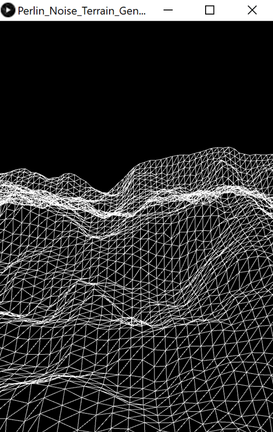

# Perlin_Noise_Terrain_Generation

## Description
This program simulates flying over terrain that is generated via Perlin noise.  
Start date: October 30, 2020  
Current version: 0.1.0  
#### Programming language(s):
- Processing (Java)
	- [Perlin_Noise_Terrain_Generation.pde](Perlin_Noise_Terrain_Generation.pde) - main program entrance sets up canvas and executes animation steps

### Display
#### Examples

### Folder structure
| Tree with Root Having Local Path | Generation Method | Description |
| -------------------------------- | ----------------- | ----------- |
| [/Perlin_Noise_Terrain_Generation](https://github.com/anderjef/Perlin_Noise_Terrain_Generation) | auto-generated by Processing | <!-- --> |

## Installation
- Download [ZIP](https://github.com/anderjef/Perlin_Noise_Terrain_Generation/archive/Perlin_Noise_Terrain_Generation.zip). Extract to a folder named Perlin_Noise_Terrain_Generation.
- Download and install [Processing 3](https://processing.org/). Please understand that Processing may have bugs of its own.
- Open any of the Processing Source Code files with the Processing IDE (PDE).
- Run the code from within the Processing IDE or export the application first.

## Usage
### Invokation
1. Method 1
	- Download the appropriate [ZIP](https://github.com/anderjef/Perlin_Noise_Terrain_Generation/archive/Perlin_Noise_Terrain_Generation.zip) then invoke the corresponding [executable](#Executables). Unless using 64-bit Windows, install or have installed [Java 8](https://java.com/en/download/).
2. Method 2
	- See [Installation](#Installation).

### Operation
Sit back, relax, and enjoy!

### Executables
- [32-bit Linux](https://github.com/anderjef/Perlin_Noise_Terrain_Generation/application.linux32/Perlin_Noise_Terrain_Generation)
- [64-bit Linux](https://github.com/anderjef/Perlin_Noise_Terrain_Generation/application.linux64/Perlin_Noise_Terrain_Generation)
- [ARM 64-bit Linux](https://github.com/anderjef/Perlin_Noise_Terrain_Generation/application.linux-arm64/Perlin_Noise_Terrain_Generation)
- [Hard Float ARMv6 Linux](https://github.com/anderjef/Perlin_Noise_Terrain_Generation/application.linux-armv6hf/Perlin_Noise_Terrain_Generation)
- [32-bit Windows](https://github.com/anderjef/Perlin_Noise_Terrain_Generation/application.windows32/Perlin_Noise_Terrain_Generation.exe)
- [64-bit Windows](https://github.com/anderjef/Perlin_Noise_Terrain_Generation/application.windows64/Perlin_Noise_Terrain_Generation.exe)

## Contributions
- Jeffrey Andersen - developer
- [YouTube The Coding Train Video](https://www.youtube.com/watch?v=IKB1hWWedMk) - inspiration

For copyright, license, and warranty, see [LICENSE.md](https://github.com/anderjef/Perlin_Noise_Terrain_Generation/LICENSE.md).